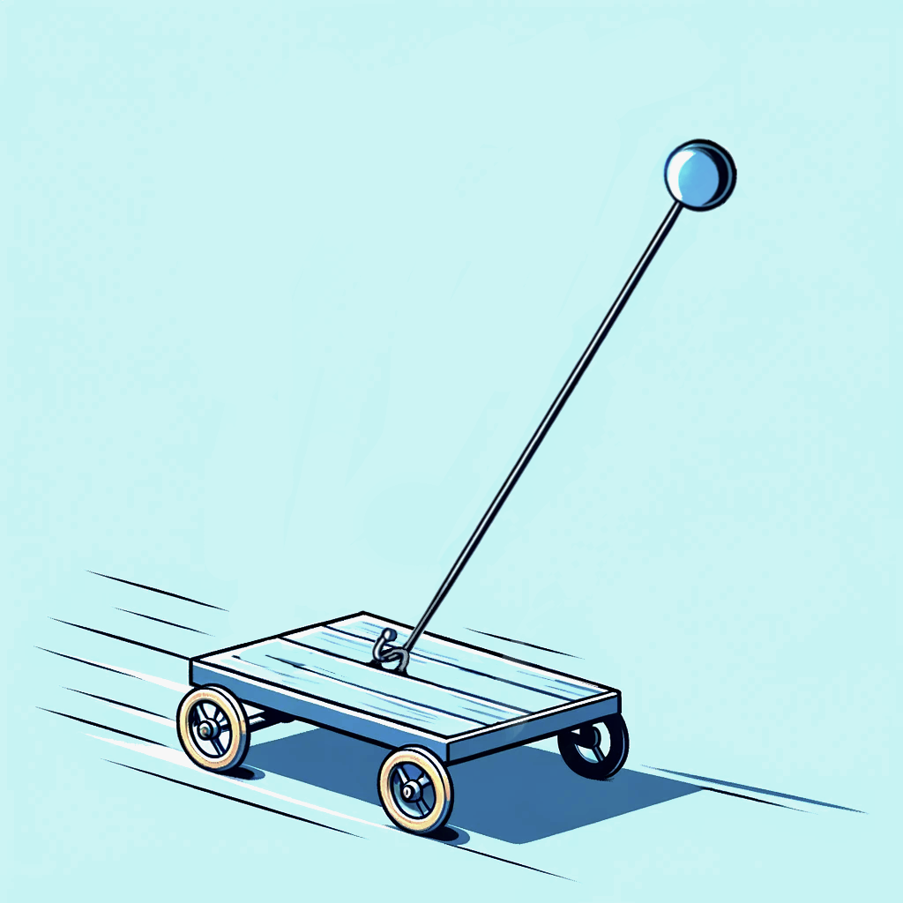
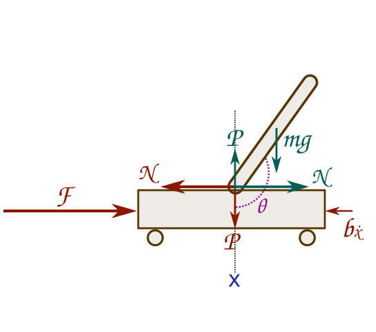
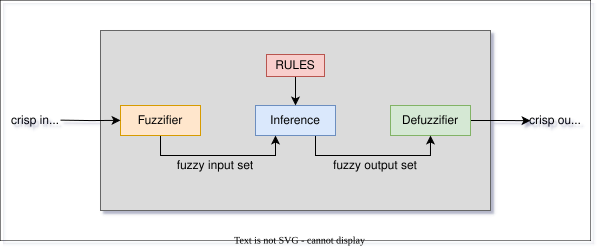
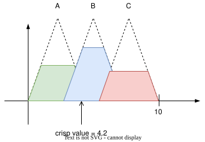
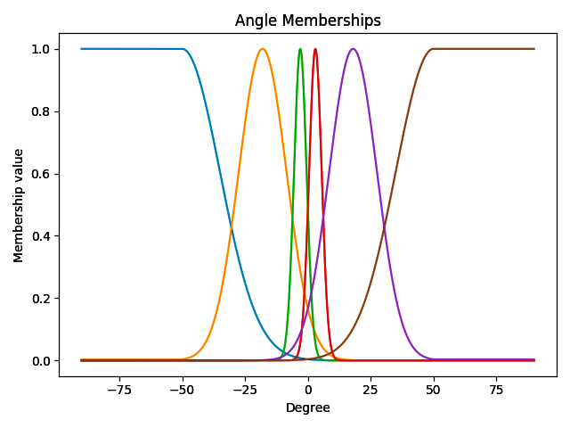
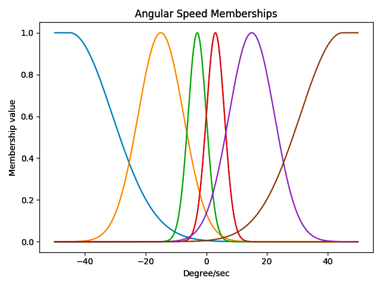
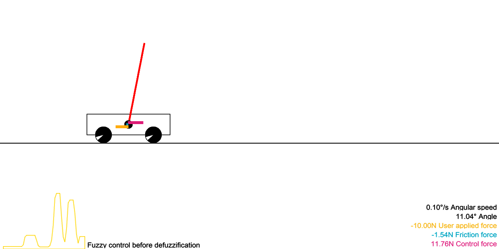

# Introduction



With some practice, it’s possible to balance a broom upright in our hand, relying largely on intuition rather than accurate measurements. Yet, the dynamics behind this seemingly simple act are more intricate than they appear. From an engineering perspective, this balancing act is analogous to the inverted pendulum, a classic problem in control theory.
 
The inverted pendulum is a system consisting of a tall rod, like our broom, but this time, it's attached to a horizontally moving cart. The objective? Keep the rod upright, compensating for any disturbances that might knock it off balance. This control problem is complex due to the numerous degrees of freedom involved, but still straightforward enough to understand and simulate.

While mathematical solutions exist to keep the pendulum vertically upright, they require precise knowledge of the system's parameters. Yet when we balance a broom, humans are clearly not relying on a mathematical model that depends on highly accurate measurements of angles and velocities. This suggests that for the inverted pendulum problem, it's possible to design a successful controller without depending on precise measurements.

What if we wanted to introduce an element of that human intuition into our control systems? Enter fuzzy logic—a method that resembles human reasoning by working with concepts that aren't strictly true or false but lie somewhere in between. For example, instead of processing exact numerical values, a fuzzy logic system might consider values like "almost upright" or "slightly tilted." This approach offers flexibility, especially when precise data is unavailable or when a system needs to adjust to unforeseen challenges.

In the early 2000s, the number and variety of fuzzy logic applications increased significantly. They ranged from consumer products such as cameras, camcorders, washing machines, and microwave ovens to industrial process control, medical instrumentation, decision-support systems, and portfolio selection. Unlike standard logic, where variables can only take two values—True or False—fuzzy logic describes things in a vaguer form. Its variables can range between 0 and 1, characterizing a variable's membership to a particular value. For instance, describing weather as "0.72 sunny and 0.18 cloudy" provides more information than simply stating "the weather today is sunny but not cloudy." With fuzzy variables, one can construct operations known as fuzzy rules. These rules resemble human thinking and are structured as "If ... then..." However, translating these rules into a soft mathematical form suitable for machine processing is essential.




Returning to our inverted pendulum on a cart problem, this system can be seen in Figure 1. Intuitively, the control force $F$ should be determined by the magnitudes of the input variables $\phi$ and $\dot{\phi}$, which measure the angle of the pendulum from the upright position and its angular velocity, respectively. Using fuzzy logic, the relationship between these variables becomes linguistic, a much weaker form than exact measurements.  Leveraging these linguistic variables, we can establish rules that determine the control $F$ using common sense knowledge. These rules can look like such as "If $\phi$ is very small, then $F$ should be small," or "If the pendulum is balanced, then hold very still, meaning do not apply any force."

# Fuzzy logic 


Now let us look in more detail at the design of a fuzzy controller. In our case, the controller receives its input as the pair $(\phi,\dot{\phi})$. We define this input space as $X \times Y$, where intervals $X$ and $Y$ represent the degrees for $\phi$ and degrees per second for $\dot{\phi}$, respectively. The output, or control space for $F$, falls within an interval that signifies the force in Newtons.

The linguistic labels representing this data are modeled as fuzzy subsets of the spaces $X$, $Y$, and $F$. These subsets are mapped using their respective membership functions. Common linguistic labels might include: negative big (NB), negative medium (NM), negative small (NS), positive small (PS), positive medium (PM), and positive big (PB).

Looking at these "If . . . then. . . " rules, we ask ourselves questions like the following: Is "If. . . then. . ." an implication operator in logic? How can one model linguistic labels like "small," "medium," and "large"? Given a finite number of "If. . . then. . ." rules, how can we handle all possible numerical inputs that will be measured by machine sensors, in order to produce actual control actions? The answers to all these basic questions lie in fuzzy logic theory. The term "fuzzy control" refers to the science of building fuzzy controllers based on the mathematics of fuzzy logic.

When we look at the "If... then..." rules, it raises several questions about their foundational logic. Does the "If... then..." structure represent a logical implication? How do we understand labels like "small", "medium", or "large" in this setting? And with a fixed number of "If... then..." rules, how does the system handle varied numerical inputs from sensors and then produce specific control actions? These questions can be answered by exploring fuzzy logic theory. Put simply, "fuzzy control" is about designing controllers using the mathematics of fuzzy logic. We'll discuss these concepts further in the following sections.

One of the distinct advantages of fuzzy logic is its capacity to process a linguistic variable—a variable characterized by words rather than numbers. Interestingly, such rule-based systems have profound roots in classical AI, such as decision trees. Unlike conventional hard computing, soft computing is designed to navigate the inherent imprecision of the sensor measurements.

As an overview, let's break down how the fuzzy decision process works step by step. Initially, a distinct set of input data is collected and transformed into a fuzzy set using fuzzy linguistic variables, terms, and membership functions – a process termed "fuzzification". Following this, an inference phase takes place, using the set of "If... then..." rules. Finally, in the "defuzzification" step, the fuzzy output is converted back to a clear, distinct output through the use of membership functions. The full fuzzy logic process is illustrated in Figure 2.

{width=130%}

## Linguistic Variables
Linguistic variables are either the input or output variables of the system. Their values are words or sentences from natural language, not numerical values. Typically, a linguistic variable is broken down into a set of linguistic terms. For example, in the context of an inverted pendulum, let the angle $\phi$ be the linguistic variable symbolizing the angle formed with the upper vertical position. To qualify the angle, we naturally use linguistic terms such as "slightly slanted" and "falling over".  Using this intuition, we can define a mapping functions, such as $\phi(t)=$ \{negative big (NB) angle, negative medium (NM) angle, negative small (NS) angle, positive small (PS) angle, positivev medium (PM) angle, and positive big (PB) angle}. This can be the set of decomposition for the linguistic variable angle. Each member of this decomposition is called a linguistic term and can cover a portion of the overall values of the angle.

## Membership Functions
Membership functions are used in the fuzzification and defuzzification steps of the fuzzy logic system, to map the non-fuzzy input values to fuzzy linguistic terms and vice versa. A membership function quantifies a linguistic term. For instance, Figure [fig:Membership-funtions-of-angle] shows the membership functions for the linguistic terms of the angle variable. An important characteristic of fuzzy logic is that a numerical value does not have to be fuzzified using only one membership function. In other words, a value can belong to multiple sets at the same time. For example, according to Figure [fig:Membership-funtions-of-angle], an angle value can be considered as “negative small” and “negative medium” at the same time, with different degrees of memberships.

## Fuzzy Rules
Within a fuzzy logic system, a rule base is constructed to control the output variable. A fuzzy rule is a simple IF-THEN rule with a condition and a conclusion.

## Fuzzy Set Operations
The evaluations of the fuzzy rules and the combination of the results of the individual rules are performed using fuzzy set operations. The operations on fuzzy sets are different from the operations on non-fuzzy sets. Let $\mu_A$ and $\mu_B$ represent the membership functions for fuzzy sets $A$ and $B$. Unlike in conventional Boolean algebra we can have  different definitions for the logic operator. The table below lists potential fuzzy operations for OR and AND operators:

|                    | **OR (Union)**                     |                       | **AND (Intersection)**                  | 
|--------------------|------------------------------------|-----------------------|-----------------------------------------|
| **MAX**            | $Max\{\mu_A(x), \mu_B(x)\}$        | **MIN**               | $Min\{\mu_A(x), \mu_B(x)\}$             |
| **ASUM**           | $\mu_A(x) + \mu_B(x) - \mu_A(x) \mu_B(x)$ | **PROD** | $\mu_A(x) \mu_B(x)$                           |
| **BSUM**           | $Min\{1, \mu_A(x) + \mu_B(x)\}$    | **BDIF**              | $Max\{0, \mu_A(x) + \mu_B(x) - 1\}$     |

After evaluating the result of each rule, these results need to be merged to obtain a final result. This process is called inference. There are different methods that can combine the outcomes of individual rules. The table below contains possible accumulation methods that are used to combine the results of individual rules. The MAX operator is typically used for accumulation.


| Operation       | Formula                                                               |
|-----------------|-----------------------------------------------------------------------|
| Maximum         | $Max\{\mu_A(x),\mu_B(x)\}$                                            |
| Bounded sum     | $Min\{1, \mu_A(x)+\mu_B(x)\}$                                         |
| Normalized sum  | $\frac{\mu_A(x)+\mu_B(x)}{Max\{1,Max\{\mu_A(x^{'}),\mu_B(x^{'})\}\}}$ |


## Defuzzification
The final step is defuzzification. Following the inference step, we are left with a fuzzy value. This value must be transformed aka defuzzified, to yield our control output. Defuzzification is carried out based on the membership function of the output variable. The result of the inference step is illustrated on Figure 3, where the shaded areas collectively represent the fuzzy outcome. Our objective is to extract a definitive value from this fuzzy representation. This is denoted by a dot in the figure. The defuzzification process is depicted in Figure 3. Several algorithms exist for defuzzification, where the most commonly used algorithms are listed in this table:


| Operation                          | Formula                                                       |
|------------------------------------|---------------------------------------------------------------|
| Center of Gravity                  | $\frac{\int_{min}^{max}u\mu(u) du}{\int_{min}^{max}\mu(u)du}$ |
| Center of Gravity for Singletons   | $\frac{\sum_{i=1}^{p}[\mu_iu_i]}{\sum_{i=1}^{p}[\mu_i]}$      |


{width=130%}


# Method and implementation

## 1. Input Parameters and Fuzzification

In the fuzzy control system designed for this application, the primary inputs are the angle $\phi$ and angular speed $\dot\phi$. These values represent the current state of the system and serve as the basis for our fuzzy logic evaluations.

To make these numerical inputs compatible with the fuzzy control system, they need to be fuzzified. Fuzzification is the process of assigning a degree of membership to each value in a set. For our system, the membership functions used are Gaussian in nature and are defined as:
$f(x)=e^\frac{-(x-a)^2}{2\sigma^2}$

The fuzzified values are then categorized into six linguistic variables, represented as:
- **NB** (Negative Big)
- **NM** (Negative Medium)
- **NS** (Negative Small)
- **PS** (Positive Small)
- **PM** (Positive Medium)
- **PB** (Positive Big)

One might wonder, that if we have access to accurate measurements, which is the case in this simulation since we are running a simulation, why would we intentionally get rid of accurate measurements? The reason is that this is just a toy example for fuzzy control logic, and even though we have accurate measurements, we are not going to take advantage of this fact.





## 2. Rule Base Construction

Using the these linguistic variables, we construct a comprehensive rule base, as outlined in the table below:

| $\phi\textbackslash\dot{\phi}$ | NB | NM | NS | PS | PM | PB |
|-----------------------------|----|----|----|----|----|----|
| NB                          | NB | NB | NB | NM | NS | PS |
| NM                          | NB | NB | NM | NS | PS | PS |
| NS                          | NB | NM | NS | PS | PS | PM |
| PS                          | NM | NS | NS | PS | PM | PB |
| PM                          | NS | NS | PS | PM | PB | PB |
| PB                          | NS | PS | PM | PB | PB | PB |

This rule table should be read the following way:

• $\textbf{\textit{IF angle is NB and angular speed is NB then the control force is NB.}}$

• $\textbf{\textit{IF angle is NB and angular speed is NM then the control force is NB.}}$

$\vdots$

• $\textbf{\textit{IF angle is PB and angular speed is PB then the control force is PB.}}$

## 3. Defuzzification
After establishing the membership values for each control force label (NB, NM, NS, PS, PM, PB), we proceed to the defuzzification step. This is crucial as the fuzzy logic system produces outputs in the form of a range of values, which needs to be translated into a distinct scalar output to implement in real-world systems.

For this purpose, the Centre of Gravity for Singletons operation is employed. This algorithm computes a crisp value, representing the control force to be applied to the cart. In simpler terms, based on the fuzzy outputs and the associated membership values, it calculates a single, unambiguous control force that best represents the desired action.


# Putting it all together

Now that we defined the system, we can write our lil fuzzy logic system:



```{python}
#| collapsed: false
import numpy as np
import matplotlib.pyplot as plt

def gaussian(x, mu=0., sig=1.):
    return np.exp(-np.power(x - mu, 2.) / (2 * np.power(sig, 2.)))


def fuzzy_and(a, b, type="max"):
    if type == "max":
        return np.fmax(a, b)


def fuzzy_and_array(a, type="max"):
    if type == "max":
        return np.max(a, axis=0)


def fuzzy_or(a, b, type="min"):
    if type == "min":
        return np.fmin(a, b)


class FuzzyControl:
    def __init__(self):
        self.resolution = 50
        self.go_left = 0.
        self.no_change = 0.
        self.go_right = 0.
        self.r = 30
        self.sample_points = np.linspace(-self.r, self.r, self.resolution)

    def fuzzify(self, angle, angular_speed):
        angle_memberships = []
        angular_speed_memberships = []
        #
        if angle > 50:
            angle = 50
        if angle < -50:
            angle = -50
        if angular_speed > 45:
            angular_speed = 45
        if angular_speed < -45:
            angular_speed = -45

        angle_mu = [-50., -18., -3., 3., 18., 50.]
        angle_sig = [15., 9.5, 2.5, 2.5, 9.5, 15.]
        for i in range(6):
            angle_memberships.append(gaussian(angle, angle_mu[i], sig=angle_sig[i]))

        angular_speed_mu = [-45., -15., -3., 3., 15., 45.]
        angular_speed_sig = [14., 7.5, 3., 3., 7.5, 14.]
        for i in range(6):
            angular_speed_memberships.append(gaussian(angular_speed, angular_speed_mu[i], sig=angular_speed_sig[i]))
        return angle_memberships, angular_speed_memberships

    def inference(self, angle_memberships, angular_speed_membership):
        #
        # How to interpret the rule base:
        # NB: negative big, NM: negative medium, NS: negative small
        # PB: positive big, PM: positive medium, PS: positive small
        # The table:
        #    NB, NM, NS, PS, PM, PB angular speed
        # NB  0   0   0   1   2   3
        # NM  0   0   1   2   3   3
        # NS  0   1   2   3   3   4
        # PS  1   2   2   3   4   5
        # PM  2   2   3   4   5   5
        # PB  2   3   4   5   5   5
        # angle
        #
        # One cell contains the control force:
        # 0 NB, 1 NM, 2 NS, 3 PS, 4 PM, 5 PB
        rule_base = [[0, 0, 0, 1, 2, 3],
                     [0, 0, 1, 2, 3, 3],
                     [0, 1, 2, 3, 3, 4],
                     [1, 2, 2, 3, 4, 5],
                     [2, 2, 3, 4, 5, 5],
                     [2, 3, 4, 5, 5, 5]]

        fuzzy_control_force = [0., 0., 0., 0., 0., 0.]
        for i in range(6):
            for k in range(6):
                pt = fuzzy_or(angle_memberships[i], angular_speed_membership[k])
                fuzzy_control_force[rule_base[i][k]] = fuzzy_and(fuzzy_control_force[rule_base[i][k]], pt)

        for i, mu in enumerate([h * 10 for h in [-3, -2., -1., 1., 2., 3]]):
            fuzzy_control_force[i] = fuzzy_or(gaussian(self.sample_points, mu, sig=2.), fuzzy_control_force[i])
        fuzzy_control_force = fuzzy_and_array(np.asarray(fuzzy_control_force))
        return fuzzy_control_force

    def defuzzify(self, fuzzy_control_force):
        rv = (np.sum(self.sample_points * fuzzy_control_force) + 1e-8) / (np.sum(fuzzy_control_force) + 1e-8)
        return rv

    @staticmethod
    def draw_member_functions():
        resolution = 1000
        angle = np.linspace(-90, 90, resolution)
        angular_speed = np.linspace(-50, 50, resolution)

        angle_memberships = []
        angular_speed_memberships = []
        for i in range(resolution):
            a, b = FuzzyControl.fuzzify(angle[i], angular_speed[i])
            angle_memberships.append(a)
            angular_speed_memberships.append(b)

        angle_memberships = np.asarray(angle_memberships)
        angular_speed_memberships = np.asarray(angular_speed_memberships)

        for i in range(angle_memberships.shape[1]):
            plt.plot(angle, angle_memberships[:, i])
        plt.title("Angle Memberships")
        plt.xlabel("Degree")
        plt.ylabel("Membership value")
        plt.show()

        for i in range(angular_speed_memberships.shape[1]):
            plt.plot(angular_speed, angular_speed_memberships[:, i])
            plt.title("Angular Speed Memberships")
        plt.xlabel("Degree/sec")
        plt.ylabel("Membership value")
        plt.show()
```

# Citation

Cited as:

    Englert, Brunó B. (Jul 2023). Balancing the Inverted Pendulum: An Introduction to Fuzzy Logic Control. https://englert.ai/posts/002_fuzzy_control/englert_ai_2_fuzzy_control.html.

Or

```ruby
@article{englert2023fuzzy,
  title   = "Balancing the Inverted Pendulum: An Introduction to Fuzzy Logic Control",
  author  = "Englert, Brunó B.",
  journal = "englert.ai",
  year    = "2023",
  month   = "Jul",
  url     = "https://englert.ai/posts/002_fuzzy_control/englert_ai_2_fuzzy_control.html"
}
```

The code to reproduce the visualization:

```{python}
#| collapsed: false
from numba import jit
from numba import prange
import math
import arcade
import multiprocessing as mp
import numpy as np

SCREEN_WIDTH = 1200
SCREEN_HEIGHT = 600


@jit(nopython=True)
def _step(dt, friction, x0, phi, omega, cart_speed, force_on_cart, pre_A, pre_B, pre_C):
    for _ in prange(100):
        cosphi = np.cos(phi)
        sinphi = -np.sin(phi)
        friction_force = -friction * cart_speed ** 2. * np.sign(cart_speed)

        cart_acc = ((cosphi * pre_A * omega ** 2 + force_on_cart + friction_force) * pre_B -
                    (pre_A * -9.81 * cosphi) * (pre_A*sinphi)) / \
                   (pre_C * pre_B - pre_A*sinphi*pre_A*sinphi)

        beta = (-cart_acc * pre_A * sinphi + (pre_A * -9.81 * cosphi)) / pre_B

        x0 += cart_speed * dt
        cart_speed += cart_acc * dt
        phi += dt * omega
        omega += dt * beta

    return x0, phi, omega, cart_speed, friction_force


class Pendulum:
    def __init__(self, dt, length=200., pendulum_mass=0.5, cart_mass=1., friction=0.0008):
        self.dt = dt
        self.length = length
        self.pendulum_mass = pendulum_mass
        self.cart_mass = cart_mass
        self.total_mass = (self.cart_mass + self.pendulum_mass)
        self.polemass_length = (self.pendulum_mass * self.length)
        self.friction = friction
        self.rotation_friction = friction

        self.manager = mp.Manager()
        self.state = self.manager.dict()
        self.state["x0"] = 0.
        self.state["y0"] = 0.
        self.state["x1"] = 0.
        self.state["y1"] = 0.
        self.state["phi"] = np.pi / 2. + 1e-1  # angle
        self.state["omega"] = 0.  # angular speed
        self.state["cart_speed"] = 0.
        self.state["friction_force"] = 0.
        self.state["force_on_cart"] = 0.
        self.state["is_close"] = False

        p = mp.Process(target=self.step, args=(self.state,))
        p.daemon = True
        p.start()

    def step(self, state):
        pre_A = self.pendulum_mass * self.length
        pre_B = self.length ** 2 * self.pendulum_mass + self.pendulum_mass * (self.length / 2.) ** 2
        pre_C = self.cart_mass + self.pendulum_mass

        while not state["is_close"]:
            state["x0"], \
            state["phi"], \
            state["omega"], \
            state["cart_speed"], \
            state["friction_force"] = _step(self.dt,
                                            self.friction,
                                            state["x0"],
                                            state["phi"],
                                            state["omega"],
                                            state["cart_speed"],
                                            state["force_on_cart"],
                                            pre_A,
                                            pre_B,
                                            pre_C)
```

```{python}
#| collapsed: false
class Simulation:
    def __init__(self):
        self.pendulum = Pendulum(0.00005)
        self.shift = 300
        self.x0 = self.shift
        self.y0 = self.shift
        self.x1 = self.pendulum.state["x1"] + self.shift
        self.y1 = self.pendulum.state["y1"] + self.shift

        self.user_applied_force = 0

        self.fuzzy_control = FuzzyControl()
        self.is_control_active = True

        self.fuzzy_control_force = np.zeros((self.fuzzy_control.resolution,))
        self.control_force = 0.
        self.fuzzy_control.draw_member_functions()

    def step(self):
        angle = ((-self.pendulum.state["phi"] / (2 * np.pi) - 1 / 4) * 360) % 360 - 180
        angular_speed = - self.pendulum.state["omega"] / (2 * np.pi) * 360
        angle_memberships, angular_speed_memberships = self.fuzzy_control.fuzzify(angle, angular_speed)
        self.fuzzy_control_force = self.fuzzy_control.inference(angle_memberships,
                                                                angular_speed_memberships)
        self.control_force = self.fuzzy_control.defuzzify(self.fuzzy_control_force)
        if self.is_control_active:
            c_f = self.control_force
        else:
            c_f = 0.
        self.pendulum.state["force_on_cart"] = c_f + self.user_applied_force

    def toggle_control(self):
        self.is_control_active = not self.is_control_active

    def draw(self):
        """ Draw our rectangle """
        self.x0 = self.pendulum.state["x0"] + self.shift
        self.y0 = self.pendulum.state["y0"] + self.shift
        self.x1 = self.pendulum.state["x0"] + self.pendulum.length * math.cos(self.pendulum.state['phi']) + self.shift
        self.y1 = self.pendulum.length * math.sin(self.pendulum.state['phi']) + self.shift

        overflow = (self.x0 // SCREEN_WIDTH) * SCREEN_WIDTH
        self.x0 -= overflow
        self.x1 -= overflow

        # Draw cart
        arcade.draw_rectangle_outline(self.x0, self.y0, 200, 50, arcade.color.BLACK)
        # Draw pendulum
        arcade.draw_line(self.x0, self.y0, self.x1, self.y1, color=arcade.color.RED, line_width=4)
        arcade.draw_circle_filled(self.x0, self.y0, 10, arcade.color.BLACK)
        # Draw wheels
        wheel_distance = 60
        arcade.draw_circle_filled(self.x0 - wheel_distance, self.y0 - 25, 20, arcade.color.BLACK)
        arcade.draw_circle_filled(self.x0 + wheel_distance, self.y0 - 25, 20, arcade.color.BLACK)
        arcade.draw_commands.draw_arc_filled(self.x0 + wheel_distance, self.y0 - 25, 19, 19, color=[255, 255, 255],
                                             start_angle=0,
                                             end_angle=30, tilt_angle=-self.x0 * 360 / (2 * np.pi * 20))
        arcade.draw_commands.draw_arc_filled(self.x0 - wheel_distance, self.y0 - 25, 19, 19, color=[255, 255, 255],
                                             start_angle=0,
                                             end_angle=30, tilt_angle=-self.x0 * 360 / (2 * np.pi * 20))
        # Terrain
        arcade.draw_line(0, self.y0 - 45, SCREEN_WIDTH, self.y0 - 45, arcade.color.BLACK, 2)

        # Draw applied force from fuzzy control
        x = [x for x in range(self.fuzzy_control.resolution)]
        x = [0] + x + [self.fuzzy_control.resolution - 1]
        x = [(_x + 2) * 4 for _x in x]
        y = self.fuzzy_control_force.tolist()
        y = [int(_y * 200) + 5 for _y in y]
        y = [0] + y + [0]

        points = list(zip(x, y))
        arcade.draw_polygon_outline(points, [255, 191, 0, 120], 2)
        arcade.draw_text("Fuzzy control before defuzzification", self.fuzzy_control.resolution * 4 + 10, 2,
                         arcade.color.BLACK, 14)

        def draw_force(center, force, y, color, thickness=3, multiplier=3):
            if force >= 0:
                left = center
                right = np.fmin(center + force * multiplier, SCREEN_WIDTH)
            else:
                left = np.fmax(center + force * multiplier, 0)
                right = center

            arcade.draw_lrtb_rectangle_filled(left, right, y + thickness, y - thickness, color)

        draw_force(self.x0, self.control_force, self.y0 + 5, color=arcade.color.BLUSH)
        draw_force(self.x0, self.pendulum.state["friction_force"], self.y0, color=arcade.color.BLUE_GREEN)
        draw_force(self.x0, self.user_applied_force, self.y0 - 5, color=arcade.color.YELLOW_ORANGE)

        text_y0 = 5
        text_y_diff = 22
        width = 500
        arcade.draw_text(
            text="{:0.2f}N Control force".format(self.control_force),
            start_x=SCREEN_WIDTH - 5,
            start_y=text_y0,
            color=arcade.color.BLUSH,
            font_size=14,
            align='right',
            anchor_x='right',
            width=width)
        arcade.draw_text(
            text="{:0.2f}N Friction force".format(self.pendulum.state["friction_force"]),
            start_x=SCREEN_WIDTH - 5,
            start_y=text_y0 + text_y_diff * 1,
            color=arcade.color.BLUE_GREEN,
            font_size=14,
            align='right',
            anchor_x='right',
            width=width)
        arcade.draw_text(
            text="{:0.2f}N User applied force".format(self.user_applied_force),
            start_x=SCREEN_WIDTH - 5,
            start_y=text_y0 + text_y_diff * 2,
            color=arcade.color.YELLOW_ORANGE,
            font_size=14,
            align='right',
            anchor_x='right',
            width=width)
        arcade.draw_text(
            text="{:0.2f}° Angle".format(((-self.pendulum.state["phi"] / (2 * np.pi) - 1 / 4) * 360) % 360 - 180),
            start_x=SCREEN_WIDTH - 5,
            start_y=text_y0 + text_y_diff * 3,
            color=arcade.color.BLACK,
            font_size=14,
            align='right',
            anchor_x='right',
            width=width)
        arcade.draw_text(
            text="{:0.2f}°/s Angular speed".format(-self.pendulum.state["omega"] / (2 * np.pi) * 360),
            start_x=SCREEN_WIDTH - 5,
            start_y=text_y0 + text_y_diff * 4,
            color=arcade.color.BLACK,
            font_size=14,
            align='right',
            anchor_x='right',
            width=width)
```

```{python}
#| collapsed: false


class Application(arcade.Window):
    """ Main application class. """

    def __init__(self, width, height):
        super().__init__(width, height, title="Fuzzy Control Logic On Pendulum")
        arcade.set_background_color(arcade.color.WHITE)
        self.simulation = None

    def setup(self):
        """ Set up the game and initialize the variables. """
        self.set_update_rate(1. / 160)  # set fps
        self.simulation = Simulation()

    def update(self, dt):
        """ Move everything """
        # print(1/dt)
        self.simulation.step()


    def on_draw(self):
        """
        Render the screen.
        """
        arcade.start_render()
        self.simulation.draw()

    def on_key_press(self, key, modifiers):
        """Called whenever a key is pressed. """
        force = 10.
        if key == arcade.key.LEFT:
            self.simulation.user_applied_force = -force
        elif key == arcade.key.RIGHT:
            self.simulation.user_applied_force = force
        elif key == arcade.key.SPACE:
            arcade.window_commands.pause(0.1)
            image = arcade.draw_commands.get_image()
            image.save('screenshot.png', 'PNG')

    def on_key_release(self, key, modifiers):
        """Called whenever a key is pressed. """
        if key == arcade.key.LEFT:
            self.simulation.user_applied_force = 0

        elif key == arcade.key.RIGHT:
            self.simulation.user_applied_force = 0

        elif key == arcade.key.ENTER:
            self.simulation.toggle_control()

    def on_close(self):
        self.simulation.pendulum.state["is_close"] = True
        super().on_close()


if __name__ == "__main__":
    window = Application(SCREEN_WIDTH, SCREEN_HEIGHT)
    window.setup()
    arcade.run()
```

