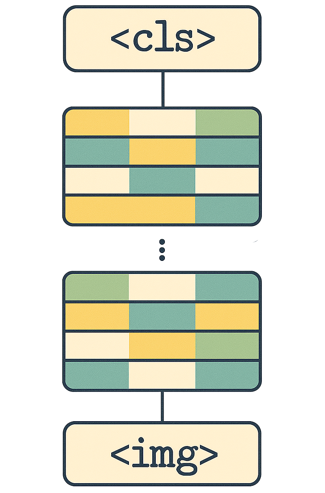

# Introduction




There’s a persistent belief in the machine learning community that Vision Transformers (ViTs) require massive datasets to perform well. Statements like "ViTs need millions of images" or "they don’t work without ImageNet-21k" are commonly accepted truths. But rarely do we pause to ask **why are ViTs so data-hungry?**

In this post, we argue that the answer lies in the very core of what makes ViTs different: the attention mechanism. We'll explore why attention creates problems early in training, how it leads to noisy gradients and unstable representations — and describe one way to address the instability. This method does not fix all the challenges; notably, it does not solve the issue of learning attention patterns that generalize well from limited data. But it does reduce training instability, especially when batch sizes are small.

# Understanding the Problem

## ViTs and Global Attention
Transformers were originally designed for text, where each token (word or subword) attending to every other token makes sense — language is naturally long-range and sequential. But in images, the locality of information matters. Neighboring pixels and patches are far more likely to be related than distant ones.

ViTs ignore this. Every patch attends to every other patch from the very start of training. That means if attention weights are random (which they are at initialization), the representation at each patch is a jumbled mix of the entire image. Early layers smear information across the whole input.

## Gradient Noise and Instability
Since each image in a batch has a different attention pattern, the resulting gradients are highly inconsistent — even within a single batch. This leads to high gradient noise and thus poor learning.

**Two key problems arise from this:**

1. **Information mixing:** Early attention layers destroy spatial locality. At the very end of the model's output layer, a patch’s embedding contains little meaningful information about the patch itself.
2. **High gradient noise:** Because attention is input-dependent, every image induces a unique mixing pattern, causing gradients to fluctuate wildly across the batch.

Together, these effects make training ViTs difficult when the batch size is small.

## Why CNNs Don’t Suffer from This

CNNs by design have inductive bias for locality and translation invariance. Filters are shared across space, and only small neighborhoods are considered at each layer. This makes them stable and thus doesn't require a larger batch size to lower the gradient noise. ViTs, on the other hand, start with no spatial bias. They must *learn* to be local and how to use attention.

# Methodology

## What Is Soft Spatial Attention Bias Annealing?

One way to improve early ViT training when using a small batch size, is by adding a **soft spatial attention bias** that makes early attention focus on nearby patches.

This bias is computed using pairwise Euclidean distances between patch positions. The further away two patches are, the less they attend to each other — controlled by a temperature parameter that is slowly increased during training. Low temperature means attention is almost identity-like (each patch attends to itself); high temperature restores full global attention.

This temperature change during the training can be interpreted as a form of **attention annealing** — gradually releasing the spatial constraint as the model becomes more stable.

::: {#fig-soft_spatial_attention_bias_annealing_progression}

<video width="99%"
       src="attention_bias_progression.mp4"  
       type="video/mp4"
       controls>
</video>

**Visualization of soft spatial attention bias annealing.** Each grid cell represent the attention bias for one patch token. Initially, attention is turned off. As training progresses, it is strongly localized to neighboring patches. Eventually, as the bias temperature increases, it gradually restores the vanilla global attention.
:::

## Code Snippet

Here’s the code to generate the attention bias:

```python
def get_soft_spatial_attention_bias(temperature: float, img_size: int, patch_size: int) -> torch.Tensor:
    """
    Create a soft spatial attention bias based on Euclidean distance between image patch positions.
    """
    # Create a [H*W, 2] grid of 2D positions
    coords = torch.stack(torch.meshgrid(
        torch.arange(img_size // patch_size),
        torch.arange(img_size // patch_size),
        indexing='xy'), dim=-1
    )
    coords = coords.reshape(-1, 2)  # [num_tokens, 2]

    # Compute pairwise squared Euclidean distances: [num_tokens, num_tokens]
    dists = torch.cdist(coords.float(), coords.float(), p=2)

    # Apply temperature
    bias = torch.softmax(-dists / temperature, dim=-1)
    bias = torch.log(bias)

    # Reshape to [1, 1, num_tokens, num_tokens] for use in attention
    bias = bias.unsqueeze(0).unsqueeze(0)

    return bias
```

We add this bias to the attention logits. It acts like a soft mask that encourages each token to attend mostly to nearby tokens — very much like a convolution. As training progresses, we increase the temperature to flatten the bias, eventually restoring global attention.


# Results
To evaluate the effectiveness of soft spatial attention bias, we trained two ViTs on ImageNet-1K under identical settings, except for the use of spatial bias annealing:

1. **Baseline**: Standard ViT with global attention from the beginning
2. **With Soft Spatial Bias**: ViT trained with spatial attention bias annealing

We report both final Top-1 accuracy:

::: {.results}

| Metric               | Baseline | With Soft Spatial Bias |
|----------------------|----------|------------------------|
| Final Top-1 Accuracy | 9.9%     | 34.5%                  |
:::

::: {#fig-acc_by_steps}
{width=99%}

**Comparison of training convergence between baseline ViT and ViT with soft spatial attention bias.** The model with spatial bias annealing converges faster and achieves higher accuracy at early training stages compared to the baseline.
:::

These results suggest that introducing soft spatial bias improves early convergence and training stability. Final performance depends on other factors such as data scale and augmentation strategy, but this method appears to reliably smooth out optimization in the early stages.


# Conclusion
This post explored why Vision Transformers (ViTs) are often considered data-hungry — not merely due to model size, but because of how attention behaves early in training. Random attention patterns lead to destructive information mixing and noisy gradients when training with a small batch size.

We showed that one way to address this is by introducing a soft spatial attention bias that restricts attention to nearby patches early in training and gradually relaxes this constraint. This process — which we refer to as attention annealing — mimics the local-to-global structure of CNNs, but keeps the flexibility of attention-based models.

Importantly, this approach does not require architectural changes, additional parameters, or more data. It simply adds a spatial prior to help stabilize early training and reduce gradient noise. As the model gains capacity to learn meaningful representations, this prior fades away.

While this method addresses the issue of gradient noise and batch size sensitivity, it does not solve everything. A second challenge remains: how to learn attention patterns that generalize well from limited data.


# Citation

Cited as:

    Englert, Brunó B. (Jul 2025). Why Do Vision Transformers Need So Much Data and How to (Partially) Fix It?. https://englert.ai/posts/004_vit_attention_mask/englert_ai_4_vit_attention_mask.html.

Or

```ruby
@article{englert2025spatialattnbiasanealing,
  title   = "Why Do Vision Transformers Need So Much Data and How to (Partially) Fix It?",
  author  = "Englert, Brunó B.",
  journal = "englert.ai",
  year    = "2025",
  month   = "Jul",
  url     = "https://englert.ai/posts/004_vit_attention_mask/englert_ai_4_vit_attention_mask.html"
}
```


