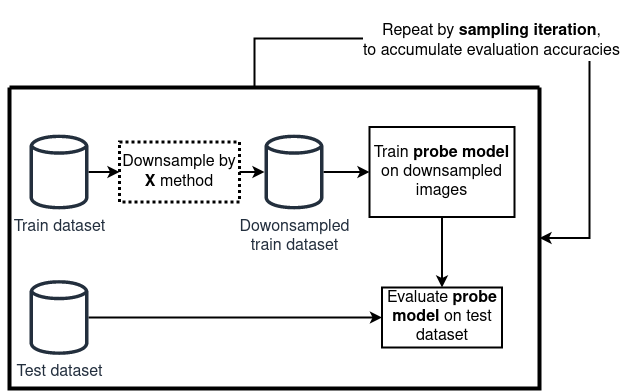
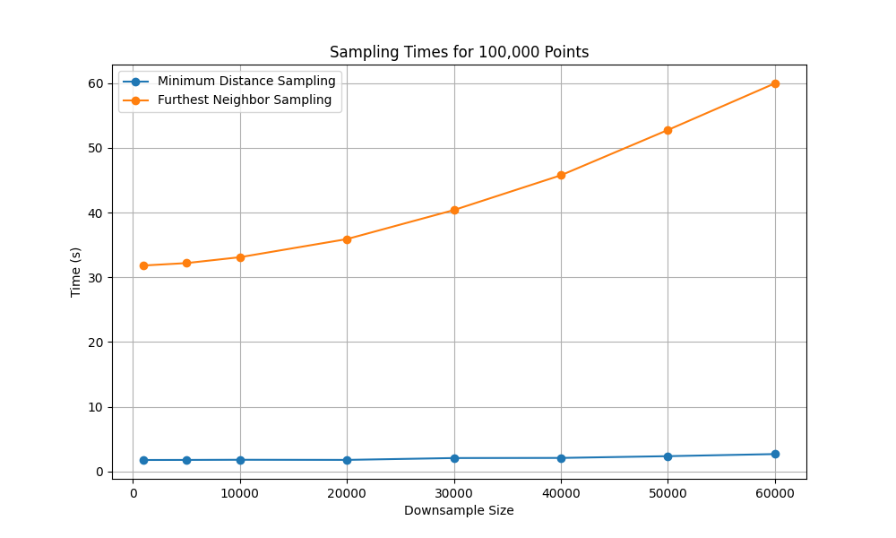
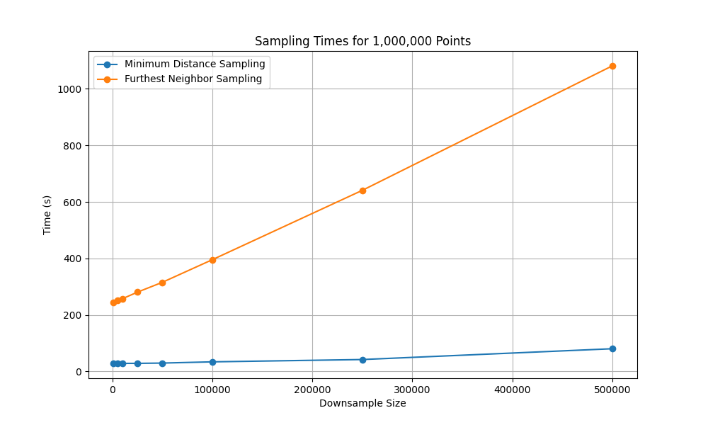

# TL;DR

* **Goal.** From a huge *unlabeled* dataset, keep a **small, diverse** subset.
* **Pipeline.** (1) turn every item into a vector (**embeddings**) → (2) select **spread‑out** points in that space.
* **Best combo (in our tests).** **SwAV** embeddings + **stochastic Minimum‑Distance Sampling (MDS)**.
* **Key trick.** Choose the distance threshold **$\delta$** from a **single global distance histogram** so collisions stay rare ⇒ near‑linear growth in **k** (kept size).
* **Scale.** GPU‑friendly; histogram pre‑aggregation + batched proposals make **million‑scale** runs practical.


# Introduction


Machine learning is increasingly applied in domains like healthcare, finance, and autonomous systems. However, the performance of these models depends heavily on the **quality and diversity** of the data used during training. While self-supervised learning (SSL) has reduced our reliance on labeled data, most downstream tasks—such as classification, detection, or segmentation—still require labeled datasets to perform well. Labeling data is expensive and the challenge becomes extremely severe with video data. Just one hour of video can produce around 108,000 frames and consume roughly 100GB of uncompressed storage. This leads to two major issues:

* **(1) Labeling visually similar and redundant data:** When annotation is costly, we want to avoid labeling frames that are nearly identical, as they contribute little new information.
* **(2) Storing and processing massive datasets**: In domains like autonomous driving, thousands of hours of driving footage can quickly balloon to petabytes of data, making storage and processing a major bottleneck.

In both cases, the core problem isn’t data scarcity—it’s **data redundancy**. Most video frames, especially in steady driving scenes, are visually repetitive. To make data more manageable and labeling more efficient, we have to reduce redundancy by removing near-duplicate frames. However, we have to do this removal in such a way to preserve a **diverse subset** that reflects the full domain diversity of the original data. This motivates the search for approaches that reduce labeling and storage costs by automatically identifying and discarding redundant data.

This is typically addressed through **downsampling**, either randomly or via domain-specific heuristics. For example, self-driving datasets may filter out temporally or spatially adjacent frames (using timestamps or GPS). However, these heuristics operate on metadata—not visual content—and can miss redundancies that are obvious to the eye. For example, a highway scene may look visually identical across multiple different GPS locations and thus would be able to pass such heuristic filters.

Another alternative is active learning, where a model selects the most informative unlabeled samples based on an existing labeled dataset. However, active learning assumes access to labels and often relies on pretrained models—resources that are not always available for a lot of unique domains, such as farming and medicine. In contrast, this work focuses on a **fully self-supervised setting**, where no labels are available. This makes the problem harder, but also more general and applicable to any real-world scenarios, especially in early-stage pipelines, or in domains where annotations are scarce or costly. Moreover, by removing labels from the loop, we avoid injecting annotation bias or propagating label noise, which can skew the sampling process.

To make this work, a method is needed that satisfies three key criteria:

* **(1)** Capture visual similarity between datapoints in a meaningful way
* **(2)** Operate without any labels
* **(3)** Scale to millions of datapoints efficiently

This research strictly focuses on that setting: selecting diverse, representative subsets from large, unlabeled datasets. Our goal is not to find the most "interesting" or "critical" moments—such as anomalies or accidents, since such a criteria would be difficult to define (or even impossible) for a self-supervised method. Instead, we define a more tractable objective: remove redundancy by selecting datapoints that are as **visually dissimilar** as possible. While this is an assumption, it aligns with the intuition that dissimilar datapoints span a wider range of content and provide better coverage of the full dataset.

To select based on visual dissimilarity, we need to define what visual similarity means. However, this is inherently subjective and hard to formalize. To address this, we adopt a common assumption in the deep learning: the structure of high-dimensional **feature vectors**, extracted from models, can serve as a proxy for perceptual similarity. If two images are close in this feature space, they are likely to be visually similar. This allows us to avoid hand-crafting similarity metrics or relying on fragile heuristics. Instead, we use the output of an off-the-shelf self-supervised model to represent each datapoint in a feature space, and apply simple distance metrics (e.g., Euclidean) to estimate visual dissimilarity.

These embeddings form as an abstraction of the input data and serve as the foundation for sampling algorithms that identify **maximally diverse subsets**. The result is a fully self-supervised pipeline for label-free redundancy reduction and subset selection, domain-agnostic, and scalable to large-scale dataset sizes. We now describe this pipeline in detail, beginning with the embeddings that define visual similarity, and then turning to the sampling strategies that enforce diversity.

  
# Method
At a high level, the pipeline has two stages:

1. **Feature embedding** — map each datapoint (e.g. images) to a vector space where Euclidean distance correlates with visual similarity.
2. **Diverse subsampling** — pick **k** points that are well spread out in that space.

We compare three embedding sources and two selection strategies. 

## Generating Feature Vectors
To turn datapoints into vectors, we compared three different embedding sources. 


1. **Pretrained classifier (supervised, baseline).**
   * **What.** Train a classifier and take features from the penultimate layer.
   * **Why include it.** Familiar reference; useful sanity check, but it **uses labels** and thus doesn’t meet the self‑supervised constraint.

2. **AutoEncoder (SSL).**
   * **What.** Encoder–decoder trained to reconstruct inputs.
   * **Why include it.** A classic SSL baseline: it compresses inputs into a latent that preserves reconstruction‑relevant information. Easy to train in new domains.

3. **SwAV (SSL).**
   * **What.** A self‑supervised clustering/contrastive method that pulls augmented views together via codebook assignments and pushes different images apart.
   * **Why we like it.** In practice, SwAV features produced well-structured spaces that work great with distance‑based selection.


## Sampling Strategies
Once datapoints have been mapped into any of the embedding spaces described above, the next step is to select a subset that is both compact and diverse. Formally, one might wish to choose the subset of size $k$ whose elements are maximally spread out, for example by maximizing the minimum pairwise distance among them. In theory, this could be done by considering every possible subset of size $k$ from $N$ datapoints. In practice, however, this is hopeless: the number of possibilities grows as $\binom{N}{k}$, which becomes astronomically large even for moderate values of $N$ and $k$. With datasets containing millions of examples, an exhaustive search is entirely infeasible.

On top of this combinatorial challenge, the geometry of real data is highly non-uniform. Feature spaces typically contain dense clusters of very similar points alongside a handful of extreme outliers. If we simply try to “spread points apart,” naïve methods end up either oversampling the outliers or oversampling the clusters, producing subsets that are not truly representative. The real goal of subset selection is therefore not just diversity in the abstract, but **re-balancing the data geometry** so that the final subset resembles a more uniform cover of the original distribution.

Because of these challenges, we turn to approximate methods that capture the spirit of the max–min objective—selecting points that are as spread out as possible—without requiring combinatorial search. In this work, we focus on two such strategies: **Furthest Neighbor Sampling (FNS)** and **Minimum Distance Sampling (MDS)**.


### Furthest Neighbor Sampling (FNS)
Furthest Neighbor Sampling (FNS) is a greedy approximation to the max–min objective. The algorithm begins by choosing a random point. At each subsequent step it selects the point that is furthest away from the set already chosen. This rule tends to spread points widely across the space and often yields good approximations of the optimal subset.

However, a critical caveat is that the feature space of real datasets is rarely uniform. Instead, it usually contains dense clusters of very similar points alongside a small number of extreme outliers. When FNS is applied directly to such a space, the outliers dominate: because they are extremely far from everything else, they are almost always selected first. As a result, the chosen subset ends up being non-uniform, filled with edge cases rather than representative examples of the data distribution.

A way to address this is to apply a structure-preserving dimensionality reduction method such as UMAP or t-SNE before FNS. These methods preserve local neighborhoods while compressing global distances. In effect, they pull outliers closer to the main data cloud and make the overall distribution appear more uniform. When FNS is run in this transformed space, the resulting subset better reflects the true variety of the dataset rather than being dominated by outliers. The trade-off is that the dimensionality reduction itself introduces additional computation and memory cost, which can become limiting at very large scale.


**Algorithm:**
```python
import numpy as np

def furthest_neighbors(all_points, downsampled_size, seed=0):
    """
    all_points: (N, D) array of embeddings
    downsampled_size: number of points to select (k <= N)
    Returns: indices of the k selected points (shape: [k])
    """
    rng = np.random.default_rng(seed)
    N = all_points.shape[0]
    # 1) start from a random point
    first = int(rng.integers(0, N))
    selected = [first]

    # 2) d_min[i] = distance from point i to the nearest selected point
    d_min = np.sum((all_points - all_points[first]) ** 2, axis=1) ** 0.5
    d_min[first] = -1.0  # mark as taken

    # 3) greedily add the furthest point, then update d_min
    for _ in range(downsampled_size):
        i = int(np.argmax(d_min))
        selected.append(i)
        d = np.sum((all_points - all_points[i]) ** 2, axis=1) ** 0.5
        d_min = np.minimum(d_min, d)
        d_min[i] = -1.0
    return np.array(selected, dtype=int)
```


### Minimum Distance Sampling (MDS)
Minimum Distance Sampling (MDS) approaches the problem from the opposite direction. Instead of explicitly maximizing the distance between points, it enforces a rule: no two selected points may be closer than a chosen threshold $\delta$. The algorithm repeatedly proposes random candidates and accepts them if they are at least $\delta$ away from all previously selected points. Otherwise, the candidate is rejected and a new one is tried. Conceptually, this avoids clustering by simply forbidding points from sitting too close together. Where FNS tries to “push” points outward, MDS succeeds by “keeping space” between them.

The efficiency of MDS comes from the two properties of this algorithm. First, we don't need UMAP or t-SNE. Since this algorithm proposes new points randomly, the issue with outliers goes away. Second, the proposed point candidates at each iteration can be done in a batched way, which greatly speeds up this algorithm. 
 
With a well-chosen $\delta$, the acceptance rate remains healthy and the number of accepted points grows almost linearly, making the method feasible at million-point scale. But the challenge is precisely in choosing $\delta$. If $\delta$ is too small, many near-duplicates slip in, and the subset is not truly diverse. If $\delta$ is too large, the algorithm spends most of its time rejecting candidates, leading to excessive collisions and wasted computation.

**Algorithm:**
```python
import numpy
import numpy as np
import torch
from tqdm import tqdm


def min_distance_sample(all_points, downsampled_size, delta, batch_size=512, seed=0):
    """
    all_points: (N, D) embeddings
    downsampled_size: number of points to select
    delta: minimum L2 distance between any two selected points
    batch_size: number of random proposals evaluated per loop
    Returns: indices of selected points (shape: [k])
    """
    num_points = all_points.shape[0]
    success = False
    all_points_gpu = torch.from_numpy(all_points).cuda().unsqueeze(0) # 1, n_points, dim
    rng = np.random.default_rng(seed)
    
    with tqdm(total=num_points) as pbar:
        for trial in range(100):
            pbar.set_description("Trial {}, opt_min_dist: {}".format(trial, opt_min_dist))

            init_index = np.random.randint(low=0, high=num_points)
            selectable_indices = torch.arange(num_points).cuda()
            selectable_mask = torch.ones(num_points).cuda().bool()
            selectable_ctr = num_points - 1
            selectable_mask[init_index] = False
            rv_indices = [init_index]

            while (downsampled_size - len(rv_indices)) <= (selectable_ctr) and not success:
                if batch_size < selectable_ctr:
                    random_indices = rng.choice(selectable_ctr, size=batch_size, replace=False)
                else:
                    random_indices = numpy.arange(selectable_ctr)

                proposed_indices = selectable_indices[selectable_mask].cpu().numpy()
                proposed_indices = proposed_indices[random_indices]
                proposed_len = len(proposed_indices)

                dist = torch.cdist(
                    all_points_gpu[:, proposed_indices, :],
                    all_points_gpu[:, np.concatenate([proposed_indices, np.asarray(rv_indices)]), :],
                    p=2.0
                )
                dist = dist[0]
                dist[range(proposed_len), range(proposed_len)] = opt_min_dist * 2
                decision_mtx = torch.le(dist, opt_min_dist).to(torch.int)

                # remove proposed points that collide with the already selected points
                rejected_mask = torch.ne(torch.sum(decision_mtx[:, proposed_len:], dim=1), 0).reshape(-1).to(torch.int)
                rejected_mask = rejected_mask.cpu().numpy()

                # instead of max independent set, just do a greedy
                accepted_indices = []
                decision_mtx = decision_mtx[:proposed_len, :proposed_len].cpu().numpy()
                for row in range(proposed_len):
                    if rejected_mask[row] == 0:
                        accepted_indices.append(row)
                        rejected_mask = np.logical_or(rejected_mask, decision_mtx[row, :])

                accepted_indices = proposed_indices[accepted_indices].tolist()
                rejected_indices = proposed_indices[rejected_mask].tolist()
                rejected_indices.extend(accepted_indices)

                rv_indices.extend(accepted_indices)
                selectable_mask[rejected_indices] = 0
                selectable_ctr -= len(rejected_indices)

                if downsampled_size <= len(rv_indices):
                    success = True
                pbar.update(n=len(accepted_indices))    

            if success:
                break
                
            # Slightly relax delta if we ran out of options late in the process
            opt_min_dist *= 0.9
            pbar.reset()

    if not success:
        raise Exception("no valid min distance found or not enough points")

    rv_indices = rv_indices[:downsampled_size]
    return rv_indices, opt_min_dist
```


#### Choosing a good $\delta$
The effectiveness of MDS depends entirely on the choice of the minimum distance threshold $\delta$. If $\delta$ is too small, then many near-duplicate points will be accepted and the subset will not be truly diverse. If $\delta$ is too large, then most proposals will be rejected and the algorithm may not be able to reach the target subset size at all.

We can formalize this by introducing a simple feasibility condition. Let $N$ denote the total number of points in the dataset, and let $h$ represent the expected number of points that get “discarded” whenever one new point is accepted at distance $\delta$. To successfully select a subset of size $k$, the following inequality must hold:

$$
h \cdot k < N.
$$

Intuitively, this condition says that the total number of discarded points must be smaller than the dataset size; otherwise, we will run out of candidates before reaching $k$.

The difficulty is that $h$ is not known in advance. It depends on the data distribution and on the chosen $\delta$. Computing $h$ exactly would require all pairwise distances, which is intractable at large scale. Instead, we estimate it statistically. The idea is to randomly sample a set of points, measure their distances to the rest of the dataset, and build a distribution of “typical distances.” From this empirical distribution we can approximate, for any candidate $\delta$, how many points would be excluded on average.

In practice, this is done by constructing a histogram of distances for many randomly chosen reference points. The histogram gives us an empirical cumulative distribution function: for a given $\delta$, we can look up the expected fraction of points within that radius. By iterating through the histogram bins, we can find the largest $\delta$ that still satisfies $h \cdot k < N$. That value becomes the operating threshold for MDS.

This statistical estimation makes MDS feasible in large-scale settings. Instead of computing billions of pairwise distances, we rely on a compressed global summary of the dataset’s geometry, which provides a principled way to set $\delta$ while keeping the method efficient and scalable.


**Algorithm for Estimating $~\delta$:**

```python
def estimate_delta(all_points, downsampled_size, batch_size, tolerance=0.5):
    """
    all_points: (N, D) embeddings
    downsampled_size: number of points to select
    batch_size: number of random proposals evaluated per loop
    tolerance: slack factor for the feasibility condition
    Returns: estimated delta value
    """
    num_points = all_points.shape[0]
    all_points_gpu = torch.from_numpy(all_points).cuda()
    histograms = []

    num_points_to_sample = int(100 * math.sqrt(num_points))
    num_points_to_sample = min(num_points_to_sample, num_points)
    num_points_to_sample = num_points_to_sample // batch_size * batch_size
    random_point_indices = list(random.sample(list(np.arange(num_points)), num_points_to_sample))

    for i in tqdm(range(0, num_points_to_sample, batch_size)):
        ref_all_points = all_points_gpu[random_point_indices[i:i + batch_size], :]
        dist_batched = torch.cdist(ref_all_points.unsqueeze(0), all_points_gpu.unsqueeze(0), p=2.0)[0]
        dist_batched = dist_batched.flatten()
        counts, bins = torch_histogram( dist_batched, dist_batched.size(0) // batch_size // 10)
        histograms.append((counts, bins))

    histograms = [(counts.cpu().numpy(), bins.cpu().numpy()) for (counts, bins) in histograms]
    merged_count, merged_bins = histograms[0]

    for (counts, bins) in histograms[1:]:
        merged_count, merged_bins = merge_hist([merged_count, merged_bins], [counts, bins])

    merged_count = merged_count / num_points_to_sample
    # remove zeros distances
    merged_count, merged_bins = merged_count[1:], merged_bins[1:]
    cumsum_counts = np.cumsum(merged_count, axis=0)
    opt_min_dist = 0

    for i in tqdm(range(1, len(cumsum_counts))):
        if (num_points * tolerance) < (cumsum_counts[i] * downsampled_size):
            opt_min_dist = merged_bins[i-1]
            break
    return opt_min_dist

def torch_histogram(xs, bins):
    min, max = xs.min(), xs.max()
    counts = torch.histc(xs, bins, min=min, max=max)
    boundaries = torch.linspace(min, max, bins + 1)
    return counts, boundaries

def interpolate_hist(edgesint, edges, hist):
    cumhist = np.hstack([0, np.cumsum(hist)])
    cumhistint = np.interp(edgesint, edges, cumhist)
    histint = np.diff(cumhistint)
    return histint

def merge_hist(a, b):
    edgesa = a[1]
    edgesb = b[1]
    da = edgesa[1] - edgesa[0]
    db = edgesb[1] - edgesb[0]
    dint = np.min([da, db])
    min = np.min(np.hstack([edgesa, edgesb]))
    max = np.max(np.hstack([edgesa, edgesb]))
    edgesc = np.arange(min, max, dint)
    histaint = interpolate_hist(edgesc, edgesa, a[0])
    histbint = interpolate_hist(edgesc, edgesb, b[0])
    c = histaint + histbint
    return c, edgesc
```

#### Relation to FNS
 FNS *maximizes* the minimum pairwise distance; MDS **enforces** a given minimum distance. If you set $\delta$ to the minimum pairwise distance achieved by FNS after **k** picks, then any MDS solution is **feasible** for that threshold, and FNS’s set is one feasible solution as well. In general, FNS solves a max‑min objective (greedy 2‑approx to k‑center); MDS solves the feasibility version for a chosen threshold, trading exactness for speed and scale.


# Experiment Setup
Evaluating the quality of a sampled subset is not straightforward. The central challenge is that “similarity” is inherently subjective. If there existed a perfect, universal metric to determine whether two datapoints were redundant, then the need for subset selection strategies would disappear. Instead, we have to rely on **proxy evaluation**.

The proxy we adopt is based on **downstream classification performance**. The idea is simple:

1. A dataset is first reduced using a given sampling method.
2. A model — the *probe model* — is trained on a downstream task on this reduced dataset.
3. The trained model is then evaluated on a test set.

If the probe model consistently achieves higher accuracy when trained on subsets produced by one sampling strategy versus another, we interpret that as evidence that the strategy yields a more informative and diverse subset. In other words, instead of directly measuring diversity, we evaluate its practical consequence: **how well does the reduced dataset support learning?**

However, this proxy evaluation is inherently noisy. Both the subsampling and the model training are stochastic processes. A single run may produce an accuracy value that is not representative of the underlying method. To address this, each experiment is repeated many times, and results are aggregated. Thus, determining *how many repetitions are enough* is important. Given that the standard deviation of probe accuracy is around 0.3%, and that we want to reliably detect performance differences of ±0.05% with 95% confidence, statistical power analysis suggests a sample size of about 150 runs per sampling method and dataset pair. This ensures that even small but consistent differences can be detected with high certainty.

::: {#fig-eval_method}
{width=60%}

The system for testing the subsampling methods. The only changing variable is the sampling method denoted by a dotted rectangle.
:::

# Results

## CIFAR-10 (5k from 50k)
CIFAR-10 is an image classification dataset with 50,000 training and 10,000 test images across 10 classes. Subsets of 5,000 training images were selected in each iteration.

Two key findings:

1. **FNS required UMAP to be competitive.**
  Without UMAP, FNS underperformed even random selection, as outliers dominated the subsets. With UMAP, however, FNS improved considerably, and in combination with SwAV achieved the highest accuracy overall (82.72%).

2. **MDS was stable across conditions.**
   MDS performed consistently close to or above baseline regardless of UMAP, and paired especially well with SwAV. This stability makes it preferable for large-scale settings, where the cost of dimensionality reduction (such as UMAP) is prohibitive.

| Embedding  | Sampling | UMAP | Mean Acc. | Difference to Uniform Sampling |
| ---------- | ------ |:----:|:---------:|:---------:|
| –  | Uniform |      |  82.47%   |               –                |
| Supervised | FNS    |    |  79.59%   |             −2.88%             |
| AutoEncoder | FNS    |    |  77.99%   |             −4.48%             |
| SwAV       | FNS    |    |  81.55%   |             −0.91%             |
| Supervised | FNS    |  ✅  |  82.50%   |             +0.03%             |
| AutoEncoder | FNS    |  ✅  |  82.25%   |             −0.22%             |
| SwAV       | FNS    |  ✅  |  82.72%   |             +0.25%             |
| Supervised | MDS    |      |  82.48%   |             +0.01%             |
| AutoEncoder | MDS    |      |  82.34%   |             −0.09%             |
| SwAV      | MDS  |      |  82.65%  |             +0.17%             |
| Supervised | MDS    |    ✅   |  82.52%   |             +0.05%             |
| AutoEncoder | MDS    |   ✅    |  82.47%%   |             0.00%              |
| SwAV      | MDS  |     ✅  |  82.64%  |             +0.17%             |
: Classification accuracy on CIFAR-10 when selecting 5k training samples out of 50k. Results compare embeddings (Supervised, AutoEncoder, SwAV), sampling strategies (Furthest Neighbor Sampling, Minimum Distance Sampling, or Uniform baseline), and the effect of UMAP dimensionality reduction (✅). Differences are reported relative to Uniform Random Sampling. {#tbl-result_cifar10}

*While the margins are small, they are consistent across 150 runs, making them statistically significant.*

## Effect of Downsampling Size
We next varied the subset size from 5k to 45k. At small subset sizes, diversity-aware sampling provided clear gains over random selection — for example, SwAV + MDS improved accuracy by +0.17% at 5k samples.

| Downsample Size | Random Uniform Sampling  | SwAV + No Dim Reduction + Minimum Distance Sampling | Difference to Uniform Sampling  |
| --------------- |:-----------:|:-----------:|:-----------:|
| 5000            |          82.47%          |                       82.65%                        |   +0.17%    |
| 10000           |          87.27%          |                       87.40%                        |   +0.13%    |
| 15000           |          89.58%          |                       89.71%                        |   +0.13%    |
| 20000           |          90.70%          |                       90.81%                        |   +0.11%    |
| 25000           |          91.35%          |                       91.47%                        |   +0.12%    |
| 30000           |          91.78%          |                       91.89%                        |   +0.11%    |
| 35000           |          92.07%          |                       92.21%                        |   +0.13%    |
| 40000           |          92.43%          |                       92.46%                        |   +0.03%    |
| 45000           |          92.62%          |                       92.63%                        |   +0.01%    |
: Effect of subset size on classification accuracy for CIFAR-10 when using SwAV embeddings with Minimum Distance Sampling (without dimensionality reduction). As the subset size increases from 5k to 45k, the relative gain over random sampling diminishes. {#tbl-result_cifar10_downsample}


## Complexity and Scaling
To understand scalability, we compared Furthest Neighbor Sampling (FNS) and Minimum Distance Sampling (MDS) on datasets of size 100,000 and 1,000,000 points, downsampling to varying subset sizes.

**FNS.** The incremental form of FNS computes one new distance per point when a center is added and maintains a nearest-distance vector. Over $k$ additions, this results in $O(N·k)$ time and **$O(N + k)$ memory, where $N$ is the dataset size, and $k$ the subset size. For large $N$, the optional UMAP or t-SNE preprocessing dominates runtime and memory cost.

**MDS.** This method requires a minimum distance parameter, denoted $\delta$. A well-chosen $\delta$ ensures that in each iteration the number of selected points increases by one, keeping the step complexity approximately at $k^2$ and the memory complexity at $O(N + k)$. However, a badly chosen $\delta$ can lead to an undesirable step complexity of $O(N^2)$ due to an excessive number of collisions. 


@fig-100ksample and @fig-1msample illustrate runtime scaling. MDS remains manageable even when selecting hundreds of thousands of points, while FNS runtime grows sharply with subset size, quickly becoming impractical at million-scale.

::: {#fig-100ksample}
{width=80%}

Empirical computational complexities for MDS and FNS on 100,000 points. The x-axis shows subset size, the y-axis runtime (seconds).
:::

::: {#fig-1msample}
{width=80%}

Empirical computational complexities for MDS and FNS on 1,000,000 points. The x-axis shows subset size, the y-axis runtime (seconds).
:::

*Note: Scaling experiments were conducted on an AMD Ryzen 9 3900x and Nvidia 1080 Ti graphics card.*

## Qualitative Results for Video 
We also applied our pipeline to raw dashcam footage. @fig-viss_dashcam shows sampled frames from a driving sequence. The subset covers a wide range of situations (e.g., different lighting, traffic conditions, and road layouts) without oversampling visually redundant near-duplicate frames.

::: {#fig-viss_dashcam fig-align="center"}
<video width="50%" src="nochange_zoomed.mp4" type="video/mp4" controls></video>  
<video width="50%" src="snow_zoomed.mp4" type="video/mp4" controls></video>  
<video width="50%" src="underground_zoomed.mp4" type="video/mp4" controls></video>  

Dashcam video with selected frames. The red flashing corner means the current frame is selected. 
:::


# Conclusion
We introduced a fully self-supervised pipeline for redundancy reduction in large unlabeled datasets. By combining feature embeddings with diversity-driven subsampling, the method creates compact subsets that better represent the variety of the original data while reducing labeling and storage costs.

Our experiments show that while Furthest Neighbor Sampling can spread points effectively, it is sensitive to outliers and often requires dimensionality reduction preprocessing. In contrast, our stochastic Minimum Distance Sampling avoids this issue, scales efficiently to millions of points, and produces more uniformly representative subsets. Among the embedding choices, SwAV consistently yielded the best representation for distance-based selection.

The best-performing configuration — SwAV embeddings with MDS and histogram-based $\delta$ estimation — produced subsets that were compact, diverse, and computationally efficient. More broadly, this demonstrates that it is possible to combat redundancy in large unlabeled datasets without labels, heuristics, or metadata, making the approach applicable across domains where annotation is scarce or costly.

This work was done during my MSc thesis under Csaba Zainkó's supervision.


# Citation

```ruby
@article{englert2019wavetract,
  title   = "Selecting Diverse Images from Vehicle Camera using Unsupervised Learning",
  author  = "{Englert, Brunó B.} and {Zainkó, Csaba}",
  booktitle = "1st Workshop on Intelligent Infocommunication Networks, Systems and Services",
  year    = "2023",
}
```


